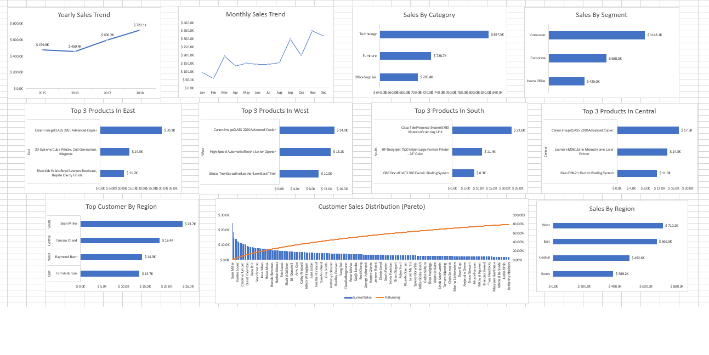

# Superstore Sales Analysis

## Project Overview

This project analyzes retail sales data from the Superstore dataset using SQL and Microsoft Excel. The objective is to transform raw transaction data into business insights through SQL queries, PivotTables, PivotCharts, and an interactive Excel dashboard.

---

## Business Problem

Retail businesses collect thousands of transactions every year, but raw sales data alone is difficult to interpret.

This project aims to answer several key business questions:

- Which regions generate the highest revenue?
- Who are the most valuable customers?
- Which products and categories perform best?
- How does sales performance change over time?
- Does customer revenue follow the Pareto Principle?

The results help management better understand sales performance and identify opportunities for improvement.

---

## Dataset

**Dataset:** Sample Superstore Dataset

**Source:** Kaggle

The dataset contains **9,800 sales records**, including:

- Order Date
- Customer
- Region
- Product
- Category
- Segment
- Sales
- Profit

---

## Tools

- PostgreSQL
- Microsoft Excel
- PivotTable
- PivotChart
- Git
- GitHub

---

## Business Questions

This project answers the following questions:

1. How have yearly sales changed?
2. Which region generates the highest revenue?
3. Who are the top 5 customers?
4. What are the top 3 products in each region?
5. Who is the top customer in each region?
6. Does customer revenue follow the Pareto Principle?
7. Which product category performs best?
8. Which customer segment contributes the most revenue?
9. How do monthly sales change over time?

---

## Dashboard Preview



---

## Key Insights

- West generated the highest sales among all regions.
- Consumer is the largest customer segment.
- Technology is the best-performing product category.
- A small percentage of customers contributes the majority of total revenue, following the Pareto Principle.
- Monthly sales fluctuate throughout the year, suggesting seasonal patterns.

---

## Project Structure

```text
Superstore-Sales-Analysis/
│
├── Data/
│   └── train.csv
│
├── SQL/
│   └── 01_create_table
|   └── 02_analysis
│
├── Excel/
│   └── Superstore_Dashboard.xlsx
│
├── Images/
│   └── Superstore_dashboard(Excel).png
│
└── README.md
```

---

## Future Improvements

- Build the same dashboard in Power BI.
- Analyze profitability in addition to revenue.
- Perform customer segmentation using Python.
- Build a sales forecasting model.